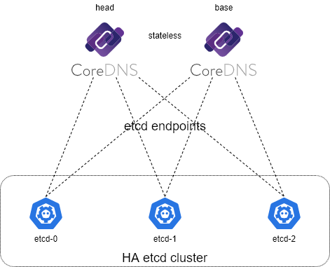

## 使用 CoreDNS 作为内网 DNS 服务器

## 高可用部署架构图



### 复制示例配置文件

```
cp -r example data
```

### 使用 docker-compose 启动服务

```
docker compose up -d
```

## PS1: 更新 RFC 1035-style zone 文件记录

对于 `hosts` 文件的更新会在 3 秒内更新解析值

对于 `auto` 插件指定的 RFC 1035-style zone 文件的更新，[官方文档](https://coredns.io/plugins/auto/#syntax)给出： `auto` 插件会在 `reload` 指定的时间重新读取 zone 文件，并且在 Serial 值更新是重新加载 zone 文件，只修改记录而不修改 Serial 值是无法应用更新的。

## PS2: zone 文件命名规则（必须遵从）

CoreDNS 根据“域”来分发解析请求到指定配置，所以必须匹配指定的域才能获取到正确的解析。 `auto` 插件在读取 `directory` 指定的 zone 目录时会根据正则表达式解析 zone 文件名（详见[官方说明](https://coredns.io/plugins/auto/#syntax)），默认规则为： `db\.(.*) {1}` i.e. 如果文件名为 `db.example.com` ， 那么解析到的域就是 `example.com` 。

```
    auto {
        directory /data/zones/default
        reload 10s
    }
```

## PS3： zone.template

```
$TTL 3600 ; 全局记录超时时间
$ORIGIN atompi.cc. ; 指定 origin ，下面的 @ 符号可以作为它的别名

; SOA 格式： [domain_name] [TTL] IN SOA [域主服务器或主DNS服务器名] [管理员email] (超时时间信息)
@  3600  IN  SOA  ns1.atompi.cc.  root.atompi.cc.  (
    2020072410 ; Serial
    1H         ; Refresh
    600        ; Retry
    7D         ; Expire
    600        ; Negative Cache TTL
)

; 配置 DNS 记录，指向 ns1.rainsay.me
@  3600  IN  NS  ns1.atompi.cc.
@  3600  IN  NS  ns2.atompi.cc.

; 配置 ns1.rainsay.me 的 A 记录, 指向coredns所在的机器
ns1      IN  A  10.0.0.53
         IN  AAAA  2001:db8:42:1::53
ns2      IN  A  10.0.1.53
         IN  AAAA  2001:db8:42:2::53

; 配置 www 的 A 记录，指向网站或其他用途的机器
www      IN  A  10.0.0.1
         IN  AAAA  2001:db8:42:1:1
; 配置泛域名，没有准确的三级子域名的域名全部指向此IPV4地址
*        IN  A  10.0.0.1
; 配置 blog 的 CNAME 记录指向 www
blog     IN  CNAME  www
```

## PS3: etcd 模式下解析记录变更指南

```
# A / CNAME 记录
# 新增/修改解析
sudo etcdctl put /coredns/com/domain/www/1 '{"host":"10.0.0.1","ttl":10}'    # /coredns 为固定前缀； /com/domain/www 为待解析域名: www.domain.com；/1 表示解析值编号，可以为任意字符串，用于表示同一个域名多个解析值
# 查看解析
sudo etcdctl get /coredns/com/domain/www --prefix
# 删除解析
sudo etcdctl del /coredns/com/domain/www/1

# PTR 记录（根据 ip 反查域名）
# 新增/修改解析
sudo etcdctl put /coredns/arpa/in-addr/10/0/0/1/ptr '{"host":"www.domain.com.","ttl":10,"type":"PTR"}' # 10.0.0.1 -> www.domain.com
# 查看及删除同上
```
